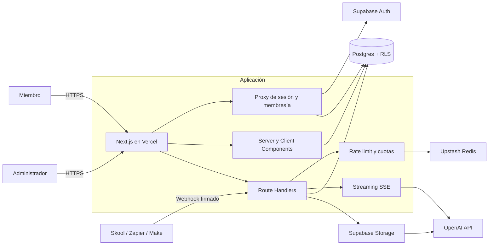
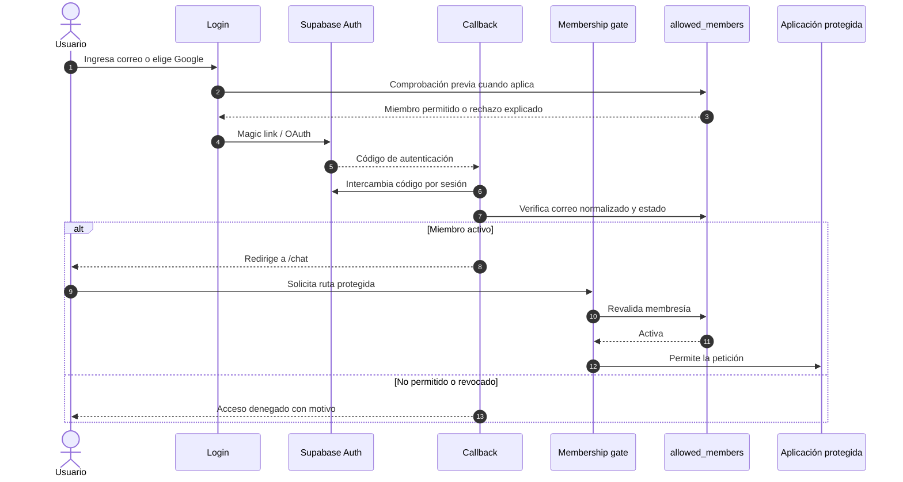
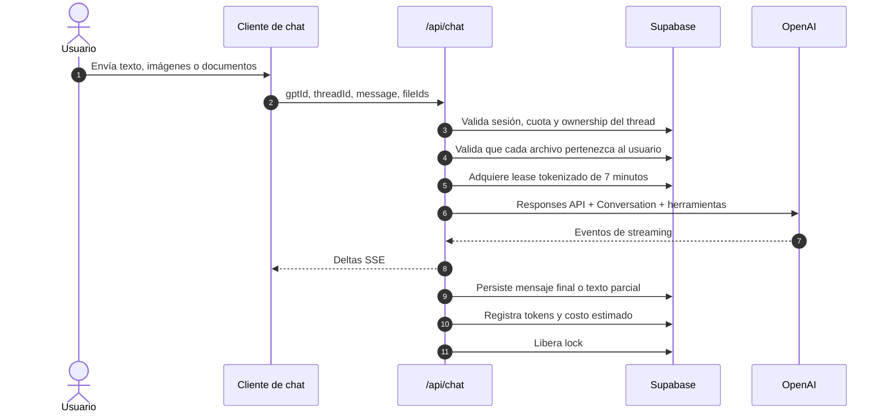
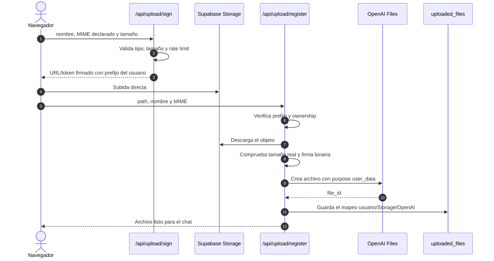
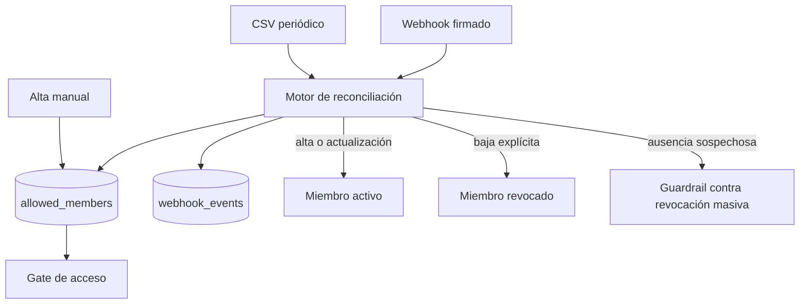
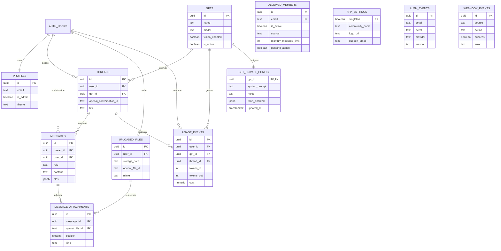

# GPT Creativos

Plataforma SaaS privada para que una comunidad publique y gestione asistentes de IA especializados. Los miembros acceden a una experiencia similar a ChatGPT, con conversaciones persistentes, texto, imágenes, documentos y voz; los administradores controlan asistentes, membresías, límites, consumo y configuración de marca desde un panel central.

Este repositorio es una muestra técnica y de portafolio. Incluye el código y las migraciones necesarias para reproducir la arquitectura, pero no contiene credenciales, datos de usuarios, prompts privados de producción ni identificadores de infraestructura.

## Estado de producción

La fase de endurecimiento del modelo de datos está aplicada en producción y fue diseñada para no interrumpir usuarios ni administradores existentes. La migración conserva campos y RPC heredados durante la transición, añade relaciones normalizadas y mantiene fallbacks compatibles.

La verificación confirmó 9 configuraciones privadas para 9 GPTs, 446 adjuntos normalizados, 7 constraints validados, cero relaciones huérfanas y bloqueo de prompts para acceso anónimo. El despliegue se valida con lint, build, pruebas HTTP y logs antes de publicarse.

## Qué problema resuelve

Una comunidad puede tener varios asistentes útiles, pero distribuir enlaces individuales de ChatGPT dificulta:

- restringir el acceso a miembros activos;
- mantener una experiencia visual consistente;
- administrar prompts, modelos e iconos sin redeploy;
- conservar conversaciones y archivos por usuario;
- medir uso, tokens y costo estimado;
- revocar acceso cuando una membresía termina;
- diagnosticar por qué una persona no pudo entrar.

GPT Creativos concentra esas responsabilidades en una sola aplicación, manteniendo separados el acceso, la experiencia de chat, la operación administrativa y los proveedores externos.

## Capacidades principales

### Para miembros

- Acceso privado mediante magic link o Google OAuth.
- Validación continua contra una lista de miembros activos.
- Catálogo de asistentes agrupados por categoría.
- Varias conversaciones persistentes por asistente.
- Cambio de asistente sin salir del shell de chat.
- Mensajes con Markdown, tablas y bloques de código.
- Adjuntos de imágenes y documentos.
- Mensajes compuestos solo por imágenes, solo por texto o por ambos.
- Dictado de voz mediante transcripción.
- Vista previa de imágenes antes de enviarlas y al recargar el historial.
- Edición, copia, regeneración y detención de respuestas.
- Temas visuales por usuario.
- Límites mensuales y mensajes claros cuando se agota la cuota.

### Para administradores

- CRUD completo de asistentes.
- Configuración de nombre, descripción, categoría, autor, icono, prompt y modelo.
- Activación independiente de visión y herramientas.
- Probador de asistentes antes de publicarlos.
- Duplicación de configuraciones.
- Orden y visibilidad del catálogo.
- Alta manual, importación CSV y sincronización por webhook.
- Activación, revocación y restauración de miembros.
- Gestión de administradores, incluida promoción diferida antes del primer login.
- White-label: nombre de comunidad, logo, soporte y enlace externo.
- Métricas de miembros, conversaciones, tokens y costo estimado.
- Auditoría de accesos y webhooks para diagnóstico.

## Stack

| Capa | Tecnología | Responsabilidad |
|---|---|---|
| Aplicación | Next.js 16, App Router, React 19, TypeScript | UI, rutas server-side y API |
| Estilos | Tailwind CSS 4 | Sistema visual responsive |
| Identidad | Supabase Auth | Magic links, Google OAuth y sesiones |
| Datos | Supabase Postgres | Usuarios, asistentes, threads, mensajes y métricas |
| Archivos | Supabase Storage | Adjuntos privados e iconos públicos |
| IA | OpenAI Responses + Conversations API | Generación, visión, documentos y streaming |
| Control de tráfico | Upstash Redis, con fallback en memoria | Rate limiting |
| Hosting | Vercel | Ejecución serverless y despliegue |

## Arquitectura



La aplicación usa dos clientes de Supabase con responsabilidades distintas:

- El cliente ligado a la sesión respeta la identidad y las políticas RLS.
- El cliente de servicio existe únicamente en el servidor para operaciones administrativas o integraciones que requieren privilegios elevados.

La `service role` nunca se expone en componentes cliente ni usa el prefijo `NEXT_PUBLIC_`.

## Flujo de autenticación y membresía

`allowed_members` es la fuente de verdad del acceso. Autenticarse correctamente no basta: el correo también debe existir y estar activo.



### Decisiones de acceso

- **Sin registro abierto:** evita cuentas huérfanas y consumo no autorizado.
- **Revalidación continua:** una baja se refleja aunque exista una sesión válida.
- **Caché breve de membresía:** reduce lecturas repetidas sin convertir el acceso en permanente.
- **Normalización de correo:** contempla mayúsculas, alias con `+` y variantes comunes de Gmail.
- **Eventos de autenticación:** registra éxito, rechazo y expulsión sin guardar tokens.
- **Administración diferida:** un correo puede quedar marcado como futuro administrador antes de crear su perfil.

## Chat multimodal

Cada asistente guarda su configuración en la base de datos. Al enviar un turno, el servidor recupera el modelo, el prompt y las capacidades vigentes; el navegador nunca decide qué instrucciones se ejecutan.



### Estados terminales cubiertos

El streaming no asume que toda respuesta termina con `response.completed`. También trata:

- respuestas incompletas por filtro de contenido;
- corte por máximo de tokens;
- rechazos del modelo;
- errores emitidos dentro del stream;
- cancelación del usuario;
- desconexión o timeout;
- fallo después de haber generado texto parcial.

Cuando existe texto parcial, se conserva. Si no llegó ningún token, se persiste una advertencia visible. Esto evita que un turno quede en el historial sin respuesta y sin explicación.

### Concurrencia

Cada conversación tiene un lease adquirido mediante RPC. El token evita que una petición antigua libere el lock de una nueva; la segunda ejecución recibe un conflicto controlado en lugar de mezclar respuestas o duplicar consumo. Los RPC heredados permanecen disponibles durante el rollout.

## Recepción y procesamiento de imágenes

La carga usa un flujo de dos pasos para evitar que archivos grandes atraviesen el body de una función serverless.



### Controles implementados

- Máximo configurable de archivos por mensaje.
- Límite de tamaño validado antes y después de la subida.
- Tipos permitidos centralizados.
- Detección real de JPG, PNG, GIF y WebP mediante firma binaria.
- Normalización de extensión para archivos pegados o mal etiquetados.
- Paths aislados por `user_id`.
- Registro idempotente: un reintento reutiliza el archivo ya procesado.
- Validación server-side del propietario antes de incluir un adjunto en el chat.
- Clasificación imagen/documento basada en el MIME acreditado por el servidor.
- Rechazo de imágenes cuando el asistente no tiene visión habilitada.
- Limpieza compensatoria si falla el mapeo en base de datos.
- Redimensionamiento cliente de imágenes grandes para reducir latencia y costo.

## Sincronización de membresías

La plataforma acepta tres fuentes: administración manual, CSV y webhook.



El reconciliador protege administradores, conserva la procedencia del registro y evita que un CSV incompleto revoque accidentalmente a una parte grande de la comunidad. Los webhooks se autentican mediante comparación segura del secreto compartido y dejan un evento auditable.

## Modelo de datos



`auth.users` pertenece a Supabase Auth. Las tablas públicas usan RLS y las operaciones elevadas se limitan a rutas server-side. Las migraciones son la fuente de verdad del esquema; `supabase/schema.sql` funciona como snapshot de referencia.

`gpts_public` expone únicamente campos de catálogo. `gpt_private_config` contiene prompts y configuración de ejecución y solo se consulta desde el servidor. `message_attachments` refuerza con foreign keys la relación entre mensajes y archivos sin romper el JSONB heredado que utiliza la UI.

## Superficie de la aplicación

### Páginas

| Ruta | Acceso | Función |
|---|---|---|
| `/` | Pública | Landing y redirección según sesión |
| `/login` | Pública | Magic link y Google OAuth |
| `/unauthorized` | Pública | Explica el motivo del rechazo |
| `/chat` | Miembro activo | Shell de conversaciones |
| `/dashboard` | Miembro activo | Catálogo de asistentes |
| `/admin` | Administrador | Métricas operativas |
| `/admin/gpts` | Administrador | Gestión y prueba de asistentes |
| `/admin/members` | Administrador | Miembros, CSV y auditoría |
| `/admin/settings` | Administrador | Marca y administradores |

### APIs relevantes

| Grupo | Rutas | Responsabilidad |
|---|---|---|
| Autenticación | `/auth/callback`, `/api/auth/check-email`, `/api/auth/signout` | Sesión y control de acceso |
| Chat | `/api/chat`, `/api/chat/regenerate` | Generación y regeneración |
| Threads | `/api/threads/**` | Crear, listar, renombrar y borrar conversaciones |
| Adjuntos | `/api/upload/sign`, `/api/upload/register` | Subida directa y registro |
| Voz | `/api/transcribe` | Transcripción de audio |
| Membresías | `/api/webhooks/skool`, `/api/webhooks/skool/bulk` | Altas, bajas y reconciliación |
| Administración | `/api/admin/**` | GPTs, miembros, admins, ajustes y auditoría |

Todas las rutas sensibles vuelven a comprobar sesión y rol; la protección visual de una página nunca sustituye la autorización de la API.

## Seguridad y privacidad

### Controles presentes

- RLS para aislar threads, mensajes, perfiles y archivos por usuario.
- Service role disponible solo en módulos server-side.
- Webhooks firmados con secreto compartido.
- Comparación de secretos resistente a diferencias de tiempo.
- Rate limiting por usuario y operación.
- Cuotas mensuales antes de iniciar generación.
- Validación de ownership de thread, GPT y archivo.
- Límite de longitud del mensaje y número de adjuntos.
- Verificación binaria de imágenes, no confianza ciega en el MIME.
- RPC administrativas sin ejecución pública.
- `search_path` fijado en funciones privilegiadas.
- Logs con detalles operativos controlados, sin devolver errores internos al navegador.
- Retención acotada para eventos de autenticación.
- Lock por conversación para prevenir carreras.
- Lease tokenizado de conversación con expiración y fallback compatible.
- Configuración privada de GPT separada del catálogo público.
- `message_attachments` con foreign keys, backfill y doble escritura tolerante al rollout.
- Grants explícitos del Data API: el catálogo público permanece disponible y prompts/configuración privada quedan fuera de `anon`.
- `.env*`, `.vercel/` y estado temporal de Supabase fuera de Git.

### Información deliberadamente ausente

- API keys y service roles.
- Tokens OAuth o sesiones.
- Project refs y URLs privadas.
- Datos reales de miembros.
- Prompts comerciales usados en producción.
- Configuración de Vercel vinculada a una cuenta.
- Logs de producción.

La configuración pública está documentada únicamente con placeholders en `.env.example`.

## Decisiones de ingeniería

| Decisión | Motivo | Trade-off |
|---|---|---|
| Responses + Conversations API | Conversaciones modernas, streaming y contenido multimodal | Dependencia del proveedor para el estado remoto |
| Copia local de mensajes | Historial rápido, auditable y disponible para UI | Requiere mantener consistencia con OpenAI |
| Storage antes de OpenAI | Evita el límite de body serverless | Añade un segundo paso de registro |
| SSE | Interfaz progresiva y simple sobre HTTP | Exige cubrir desconexiones y estados terminales |
| Lock en Postgres | Consistencia entre instancias serverless | Una ejecución por thread |
| RLS + checks server-side | Defensa en profundidad | Más políticas y validaciones |
| GPTs configurables en DB | Cambios sin redeploy y panel no técnico | El prompt debe protegerse en endpoints admin |
| Rate limit con fallback | Desarrollo local sin Redis y producción distribuida | El fallback no es global |
| Costo estimado localmente | Dashboard inmediato sin pipeline externo | Debe actualizarse cuando cambian precios/modelos |
| White-label en DB | Una misma base sirve a distintas comunidades | Requiere validar assets y metadata dinámicos |

## Optimizaciones implementadas

### Rendimiento

- Consultas independientes ejecutadas en paralelo antes del streaming.
- Historial cargado bajo demanda desde el cliente.
- Índices para relaciones y consultas frecuentes.
- RPC para obtener el último mensaje de varios threads evitando N+1.
- Redimensionamiento de imágenes antes de subirlas.
- Subida directa del navegador a Storage.
- Caché breve de membresía en el proxy.
- Componentes de chat memoizados donde el render es frecuente.
- Rate limiting distribuido con Upstash en producción.

### Costo

- Modelos configurables por asistente.
- Nivel de razonamiento reducido para tareas que no lo necesitan.
- Conteo de tokens de entrada y salida.
- Estimación de costo por turno y agregación administrativa.
- Límites mensuales por miembro con default global y override individual.
- Cancelación propagada a OpenAI para no seguir generando después de pulsar “Detener”.
- Reutilización idempotente de adjuntos durante reintentos.

### Confiabilidad

- Persistencia de respuestas parciales.
- Manejo explícito de `completed`, `incomplete`, `failed`, `refusal` y `error`.
- Cleanup compensatorio entre Storage, OpenAI y Postgres.
- Auditoría de accesos y webhooks.
- Guardrails en sincronizaciones masivas.
- Scripts de limpieza en modo informativo antes de borrar.
- Migraciones versionadas e idempotentes cuando corresponde.

### Endurecimiento del modelo aplicado

La fase 1 añadió `gpt_private_config` para separar la configuración sensible del catálogo público y `message_attachments` para relacionar cada archivo con su mensaje mediante claves foráneas. El campo JSONB heredado `messages.files` continúa como read model compatible durante la transición.

También se validan ownership compuesto de mensajes y threads, estados de conversación, cuotas no negativas, unicidad de conversaciones OpenAI y unicidad de rutas de Storage por usuario. No se eliminaron tablas ni columnas existentes.

## Mejoras futuras

Estas son optimizaciones posibles, no funcionalidades afirmadas como terminadas:

- Tests de integración para auth, RLS, subida y streaming con proveedores simulados.
- CI con lint, build, escaneo de secretos y validación de migraciones.
- Observabilidad centralizada con trazas correlacionadas por request/thread.
- Cola de trabajos para limpieza y sincronizaciones extensas.
- Reconciliación periódica entre mensajes locales y conversaciones remotas.
- Cálculo de costos alimentado por una tabla versionada de precios.
- Moderación previa configurable por comunidad.
- Borrado automático de adjuntos por política de retención.
- Exportación de datos y eliminación de cuenta asistida.
- Accesibilidad auditada con pruebas automáticas.
- Internacionalización de interfaz y correos.

## Estructura del proyecto

```text
src/
├── app/
│   ├── (protected)/          # Experiencia de miembros
│   ├── admin/                # Panel administrativo
│   ├── api/                  # Route handlers
│   └── auth/callback/        # Finalización del login
├── components/
│   ├── chat/                 # Shell, mensajes, sidebar y composer
│   └── admin/                # Herramientas administrativas
├── lib/
│   ├── supabase/             # Clientes browser/server
│   ├── chat-*.ts             # Contenido, stream y transporte
│   ├── upload-*.ts           # Límites, firmas y normalización
│   ├── membership.ts         # Reglas de acceso
│   ├── members-sync.ts       # Reconciliación
│   ├── quota.ts              # Cuotas mensuales
│   ├── rate-limit.ts         # Redis + fallback
│   └── pricing.ts            # Estimación de costo
└── proxy.ts                  # Sesión y membership gate

supabase/
├── migrations/               # Historial reproducible del esquema
├── email-templates/          # Correos versionados
├── config.toml               # Configuración local de Supabase
└── schema.sql                # Snapshot

scripts/                      # Bootstrap, backfills y limpieza
docs/                         # Operación y comparación de modelos
```

## Ejecución local

Requisitos:

- Node.js `>=20.9`;
- un proyecto de Supabase;
- una API key de OpenAI.

```bash
git clone https://github.com/Danzstorm/gpt-skool-creativos.git
cd gpt-skool-creativos
npm install
cp .env.example .env.local
npm run dev
```

La aplicación queda disponible en `http://localhost:3000`.

Para validar una compilación de producción:

```bash
npm run lint
npm run build
npm run start
```

En Windows, no conviene ejecutar `build` y `dev` simultáneamente sobre el mismo directorio porque ambos escriben en `.next/`.

## Variables de entorno

Consulta `.env.example`. Los valores se muestran como placeholders y deben cargarse localmente o en el proveedor de hosting.

| Variable | Alcance | Uso |
|---|---|---|
| `NEXT_PUBLIC_SUPABASE_URL` | Browser y servidor | Endpoint público de Supabase |
| `NEXT_PUBLIC_SUPABASE_ANON_KEY` | Browser y servidor | Cliente sujeto a RLS |
| `SUPABASE_SERVICE_ROLE_KEY` | Solo servidor | Operaciones privilegiadas |
| `OPENAI_API_KEY` | Solo servidor | Responses, Files y transcripción |
| `NEXT_PUBLIC_SKOOL_URL` | Browser | Enlace público de la comunidad |
| `SKOOL_WEBHOOK_SECRET` | Solo servidor | Autenticación de webhooks |
| `UPSTASH_REDIS_REST_URL` | Solo servidor | Rate limit distribuido |
| `UPSTASH_REDIS_REST_TOKEN` | Solo servidor | Acceso a Redis |
| `NEXT_PUBLIC_GOOGLE_AUTH_ENABLED` | Browser | Habilita el botón OAuth |
| `NEXT_PUBLIC_SITE_URL` | Browser y servidor | Metadata y URL canónica |

Nunca uses `NEXT_PUBLIC_` para una credencial secreta.

## Base de datos

El proyecto utiliza migraciones imperativas:

```bash
supabase link --project-ref <project-ref>
supabase db push
```

Los buckets esperados son:

- `gpt-icons`: público, para iconos administrados;
- `chat-uploads`: privado, para adjuntos temporales y persistencia visual.

Después de aplicar migraciones, se debe revisar RLS, permisos de funciones y grants del Data API. En proyectos nuevos de Supabase, la exposición de tablas puede requerir grants explícitos además de las políticas RLS.

Para auditar una instancia existente sin imprimir PII, contenido ni prompts:

```bash
npm run audit:data-model
```

El comando informa conteos agregados, ownership, duplicados, adjuntos huérfanos, valores inválidos y si las columnas privadas son accesibles anónimamente.

## Primer administrador

El bootstrap concede membresía y rol administrativo de forma idempotente:

```bash
npm run admin:bootstrap -- admin@example.com
```

Si la persona aún no inició sesión, la promoción queda pendiente y se aplica al crear el perfil.

## Scripts operativos

| Comando | Acción |
|---|---|
| `npm run admin:bootstrap -- <email>` | Habilita al primer administrador |
| `npm run cleanup:orphans` | Detecta y limpia archivos sin referencias |
| `npm run cleanup:orphan-users` | Informa cuentas huérfanas; exige confirmación para borrar |
| `npm run backfill:gpt-config` | Migra configuraciones heredadas de asistentes |
| `npm run backfill:messages` | Recupera mensajes de conversaciones antiguas |
| `npm run audit:data-model` | Auditoría agregada de integridad y permisos |

Los scripts que eliminan recursos están diseñados para requerir una confirmación explícita o permitir dry-run.

## Despliegue

La arquitectura está pensada para Vercel:

```bash
npx vercel
npx vercel --prod
```

Consideraciones:

- configurar variables por separado para Preview y Production;
- registrar la URL final en los redirects de Supabase Auth;
- configurar SMTP propio para magic links en una comunidad real;
- utilizar un runtime que permita hasta 300 segundos en las rutas de chat y registro de archivos;
- activar Redis distribuido para que el rate limit sea consistente entre instancias;
- validar login, chat con imagen, revocación y panel admin después del deploy.

## Documentación adicional

- [`docs/GUIA-DE-USO.md`](docs/GUIA-DE-USO.md): operación diaria y administración.
- [`docs/COMPARATIVA-MODELOS.md`](docs/COMPARATIVA-MODELOS.md): criterios de selección y costo de modelos.
- [`supabase/migrations/`](supabase/migrations/): evolución y decisiones del esquema.

## Alcance del portafolio

El repositorio demuestra diseño full-stack, integración de IA multimodal, seguridad con Supabase, streaming resiliente, administración operativa y optimización de costos. Una instalación nueva comienza vacía: los asistentes, miembros, conversaciones y secretos se crean en la infraestructura de quien despliega el proyecto.
